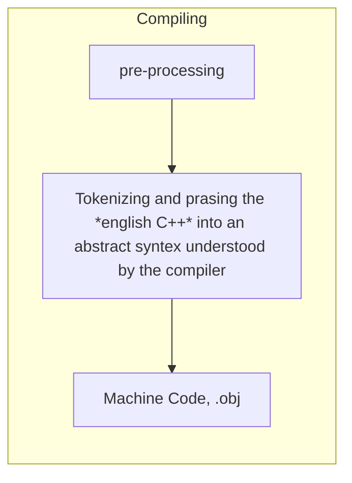

# **C++** 
# Part 1


#### [Table of Contents](README.md#table-of-contents)


## Introduction


<br>

**Notes**
* **Preprocessor Statements:** "#" - pre-processor statement, is the first thing a compiler processes when receiving a file. Then it compiles. In the case of **include** it literally copies the content of that header file and places on this file, as if was a single one for compilation purposes.
* **Entry Point:** - "main" is the entry point for the application. does not have to return anything (default is 0). It is a special case, although we have it as ```int main(){}```.
* "<<" are an overload operator. Operators are just functions: ```std::cout << "ola" << "hi"``` could just be ```std::cout.print("ola").print("hi")```.
* ```std::cin.get();``` waits for user to press "Enter".
* **Solution Configuration** - Debug or Release = set of rules that applies to building of a project ; **Solution Platform** - x64 or x86 - the platform we're targetting with our current compilation.
* **Declaration** - statement that tells the compiler this symbol/function exists (is the function name declared, normally at the header).
* **/Definition** - this is what this function is/the body (is the actual logic code of the code).


## Compiler



* Each file, or cpp file, or if it includes others directly, ends up on a single translation unit (.obj)

* Pre-processes:
    * *#include* - just goes to the include file and copies and pastes the file here.
    * *#define INTEGER cherno* - will search for the "INTEGER" word in the file and replace it by cherno.
    * *#if* and *#endif* - checks conditions, this can be use for the compiler to ignore parts of code, etc. at pre-compile time.
* **obj file** it is a binary file. With Visual studio, for example, we can select throught the PReprocessor options to generate a readable file of the pre compilation, and from the Output Files an Assembly file of the compiled object file.
* Optimization - We can also change compilation optimizations for speed, space, etc. This, for example, can simplify the machine instructions (e.g. instead of doing `5x2`, just places directly `10` in memory).


## Linker

Finds where each symbol and function is and links them. Also checks for the entry point (main). So we can compile a file without a main, but get an error if build as an executable needs an entry point.

* The linker only has to link actually used code
* Declaring static means this method is only declared once on this translation unit.
* Use static - then this is only on that file scope
* Use inline - then it replaces this call by the content

There is static and dynamic linking. More of this in the future.


## Variables

Allow to name and store a piece or variable data, in stack or heap memory.

The actual only difference between variables is the size they occupy.


<div style="width: 100%; float: left;">

| Type          | Bytes | Bits  | Range Min                     | Range Max                     | Range Exponents of 2    | Range Exponents of 2 |
| --------------| ------| ------| ------------------------------|-------------------------------| ------------------------|----------------------|
| int8_t        | 1     | 8     |                       -128    |                       127     | -2^7                    | 2^7 - 1              | 
| int16_t       | 2     | 16    |                    -32 768    |                    32 767     | -2^15                   | 2^15 - 1             | 
| int32_t       | 4     | 32    |             -2 147 483 648    |             2 147 483 647     | -2^31                   | 2^31 - 1             | 
| int64_t       | 8     | 64    | -9 223 372 036 854 775 808    | 9 223 372 036 854 775 807     | -2^63                   | 2^63 - 1             | 
| uint8_t       | 1     | 8     | 0                             |                       255     | 0                       | 2^8 - 1              |
| uint16_t      | 2     | 16    | 0                             |                    65 535     | 0                       | 2^16 - 1             | 
| uint32_t      | 4     | 32    | 0                             |             4 294 967 295     | 0                       | 2^32 - 1             | 
| uint64_t      | 8     | 64    | 0                             | 18 446 744 073 709 551 615    | 0                       | 2^64 - 1             |
| char          | 1     | 8     | -128                          |                        127    | -2^7                    | 2^7 - 1              | 
| short         | 2     | 16    |                    -32 768    |                     32 767    | -2^15                   | 2^15 - 1             | 
| int           | 4     | 32    |             -2 147 483 648    |              2 147 483 647    | -2^31                   | 2^31 - 1             | 
| long          | 8     | 64    | -9 223 372 036 854 775 808    |  9 223 372 036 854 775 807    | -2^63                   | 2^63 - 1             | 
| float         | 4     | 32    | 3.4e-38                       | 3.4e+38                       | 2.9e-38                 | 2.3e+37              |
| double        | 8     | 64    | 1.7e-308                      | 1.7e+308                      | 1.7e-308                | 1.7e+308             | 
| long double   |10/12/16|96/112/128| 1.7e-4932                 | 1.7e+4932                     | 1.7e-4932               | 1.7e+4932            | 
| bool          | 1     | 8     | false                         | true                          | false                   | true                 |
| void *        | 8     | 64    | -9 223 372 036 854 775 808    | 9 223 372 036 854 775 807     | -2^63                   | 2^63 - 1             | 
| wchar_t       | 2     | 16    |                    -32 768    |                    32 767     | -2^15                   | 2^15 - 1             |
| char16_t      | 2     | 16    |                    -32 768    |                    32 767     | -2^15                   | 2^15 - 1             |   
| char32_t      | 4     | 32    |             -2 147 483 648    |             2 147 483 647     | -2^31                   | 2^31 - 1             |   
| nullptr_t     | 0     | 0     | 0                             | 0                             | 0                       | 0                    |   
| size_t        | 0 / 8 | 0 / 64| 0                             | 2^64 - 1                      | 0                       | 2^64 - 1             |   
| intptr_t      | 0 / 8 | 0 / 64| -2^63                         | 2^63 - 1                      | -2^63                   | 2^63 - 1             |  
| uintptr_t     | 0 / 8 | 0 / 64| 0                             | 2^64                          | 0                       | 2^64                 |   

</div>

E.g., a bool takes 8 bits instead of 8 because due to memory it uses the minimum, that is 1 byte=8bits. Of course, with some maneuvering and tricks we can manipulate memory up to bits level, if we know what we are doing :smile: 


## Functions

Functions are blocks of code that we write to perform a specific task. If part of a class, it is called method.

The functions should be manly for us to avoid code duplication.

When a function is called (the compiler generates a call instruction), the entire **stack** frame for the function needs to be created, meaning things like parameters need to be pushed onto the **stack** and also the return address, so what happens is we jump to a different part of the binary and then we jump back.This jumping takes time. This is not the case for inline functions though (more on this later).


## Header Files

By using the header files, we can have the functions (and other items) declared there and instead of copying this declarations everywhere, for example, we just need to include the header.

We should use header guards, as `#pragma once` or `#ifndef _NAME_OF_HEADER_H`, to enforce that this file is only taken once in case of circular/repeated includes among several files.

Includes using:
* `<>` (angular brackets) - the compiler searches first for the header files included using this notation in the standard library directories (i.e., /usr/include). This notation tells the compiler that it should look for the file in the system's include directories, which contain standard headers and libraries installed on the system.
* `""` (quotes) - the compiler searches first for the file in the current directory. If the file is not found in the current directory, it then searches in the standard library directories. This notation tells the compiler that it should look for the file in the current directory first, and if not found there, then search the system's include directories.
 
In summary, using angle brackets (< >) is more specific to including files from the system's standard library, while using quotes ("") allows you to include files from the current directory as well as the system's standard library.

From the standard libraries, files from C standard normally end with .h while standard C++ does not. E.g. `#include<stdio.h>` vs `#include<iostream>`.


## Debug

Make sure you are in Debug mode. More specifics depend on the used tool, but normally you select a breaking point and the execution will stop into it, in case it passes this part.

Under Debug mode the compiler does some extra things, like put "C" on uninitialized memory. This is to help debug and identify, in this case, we did not initialize this part. 
Anyway, always test with Release exactly because of this differences, as might provoke different behaviors.


## Conditions and Branches

Used to evaluate conditions and based on that, branch a code to be executed, as in, depending on the evaluation, jump to a specific place in memory to execute that code. This, of course, can have some performance impact, compilers sometimes also optimize this to avoid having this performance hit.

* `==`-> Equal operator.

One way of improving the performance, is to evaluate the real need of using a condition instead of some mathematical calculation or other option.


## Loops

Namely, *for* and *while* loops.

* *for*: ```for(int i=0; i<5; i++) ``` - The first statement initializes, the variable that we use on the second part as a condition for the loop to run, and the third that performs the modification of this variable in the 2nd condition.
* *while*: ```while(i<5)``` - Will loop while the condition is true.
* *do while*: ```do while(condition)``` - Similar to while but it always run at least once.

There is no rule on which to use, one can be that, if you use a variable that already exists, you can use *while* as it does not force the declaration or direct increment of a variable. *For* loops are also very used for ordered loops, like iterate through an array. 


## Control Flow

Control flow statements work with loops.

* *continue*: This keyword is exclusively used inside looping structures, such as for or while, to skip the rest of the current iteration and move on to the next one. E.g. (output:1 3 5 7 9):
    ```cpp 
    for(int i = 0; i < 10; ++i) {
        if(i % 2 == 0) {
            continue; // Skips even numbers and continues with the next iteration (next odd number).
        }
        std::cout << i << "\n"; // Will only print odd numbers.
    }
    ```

* *break*: This keyword is used to terminate a loop or switch statement prematurely, essentially jumping out of the enclosing block of code. It's commonly employed in loops but can also be found in switch statements.
    ```cpp
    for(int i = 0; i < 10; ++i) {
        if(i == 5) {
            break; // Terminates the loop as soon as 'i' reaches 5.
        }
        std::cout << i << "\n"; // Will print numbers from 0 to 4.
    }
    ```
* *return*: This keyword serves to exit a function entirely, thereby stopping its execution and returning control to the caller. It's particularly useful when you have reached a point in your code where it doesn't make sense to continue executing the rest of the function.
    ```cpp
    int divide(int a, int b) {
        if(b == 0) {
            return 0; // Exits the function immediately and returns 0 when 'b' is 0.
        }
        return a / b; // Regular division operation when 'b' isn't 0.
    }
    ```
    

## Pointers

### Raw Pointers

A pointer is an integer that stores a memory address.

Types are used for data manipulation, but are meaningless in a broad sense.

Example pointer:
```cpp
    int var = 8;    // Created on the stack
    int* ptr = &var;
    *ptr = 10;      // Dereferencing a pointer and writing on it
    std::cout<< var << std::endl;
```
Example double pointer:
```cpp
    char * buffer = new char[8];    // Created at the heap
    memset(buffer, 0, 8);   // Fills this memory with 0
    char ** ptr = &buffer;  // Double pointer (pointer to a pointer)
    delete[] buffer;
```
Example changing pointer:
```cpp
    int a = 5;
    int b = 8;
    int* ref = &a;  //ref points to a
    *ref = 2;   //a = 2
    ref = &b    //ref points now to b
    *ref = 1;   /b = 1
    std::cout<< a << std::endl; //2
    std::cout<< b << std::endl; //1
```


## References

Is a way to reference an existing variable. Unlike a pointer, we cannot create a new reference. They do not occupy memory, they refer to already existent objects.

Once you declare a reference, unlike pointers, you cannot change what it references.

E.g.:
```cpp
    int a = 5;
    int b = 8;
    int& ref = a;   //ref references to a;
    ref = b;    //same as a=8; ref still references to a, just sets the value a to be 8
```

Simple example:
```cpp
    int a = 5;
    int* b = &a;    // "&" not next to a type, is the address
    int& ref = a;   // "&" next to a type means reference. This creates an alias (does not exist in compile code, only on our source code).
    ref = 2;
    std::cout<< ref << std::endl;   //Will print a (5).
```

Broader example:
```cpp
void Increment(int value){  //This just copyes "value" to the function, does not change the original.
    value++;
}

void Increment2(int* value){  //This receibves the address, so it can actually chaneg the original value
    (*value)++;   //only "value++" would just increment the address and not the value.
}

void Increment3(int& value){  //This directly access and changes the original value without need to reference it from the address from a pointer (e.g. Increment2).
    value++;
}

int main(){
    int a=5;
    Increment(a);
    std::cout<< a << std::endl; //5
    Increment2(&a);
    std::cout<< a << std::endl; //6
    Increment3(a);
    std::cout<< a << std::endl; //7
}
```

In sum, references for many options is cleaner than using a pointer.


## Classes

Classes in C++ are user-defined data types that contain both data (attributes) and functions (methods), enabling encapsulation and abstraction, which are fundamental principles of Object-Oriented Programming.

Classes are "type", therefore their naming should be unique.

Variables that are made from class types are called objects.


## Classes vs Structs

In short technically, just the visibility, a class is private by default. Only for compatibility structs still exist.

Among different definitions of usage, an definition I sympathize is, for example, to just represent data and not big functionality or even inheritance, structs can be used.

### Struct example

```cpp
struct Vec2{
    float x, y;
}   
```

### Class example

```cpp
    class Log{
    public: //for public variables
        const int LogLevelError = 0;
        const int LogLevelWarning = 1;
        const int LogLevelInfo = 2;
    private:
         int m_LogLevel = LogLevelInfo;
    public: //for public methods
        void SetLevel(int level){
            m_LogLevel = level;
        }

        void Error(const char* message){
            if(m_LogLevel >= LogLevelError){
                std::cout << "[ERROR]: " << message << std::endl;
            }
        }
        void Warn(const char* message){
            if(m_LogLevel >= LogLevelWarning){
                std::cout << "[WARNING]: " << message << std::endl;
            }
        }
        void Info(const char* message){
            if(m_LogLevel >= LogLevelInfo){
                std::cout << "[INFO]: " << message << std::endl;
            }
        }
    }

    int main(){
        Log log;
        log.SetLevel(log.LogLevelWarning)
        log.Warn("Hello!");
    }
```


## Static

In C++, static members (variables and functions) behave differently based on whether they're declared inside or outside their respective classes. Here's a breakdown:

- Static outside of a class means that the linkage of that symbol that was declared to be static is going to be internal, meaning, it is only going to be visible to that translation unit that has defined it in.
- Static variable inside a class or struct means that variable is actually going to share memory with all of the instances of the class, meaning that basically across all instances that one creats of that class or struct, there is only going to be on instance of that static variable, and a similar thing applies to static methods in a class.


### Static outside a class

Inside a *.cpp* file we declare a static varlable, e.g.:
<br> ```static int s_Variable = 5;```. 
<br> Here the linker will not look outside this translation unit for linkages to this variable.

It kind of works like private inside a class, we cannot see it from outside. If one removes the static, we get a duplication linkage error.


### Static for classes and structs

If static is used inside a class, for a variable it means that there is only going to be one instance of that variable across all instances. So if one instance changes it, it will reflect on all others. At that point, there is no value in referring to the variable through a class instance.

Similar goes with methods, where we do not get access to the class instance, and therefor can even be called without a class instance and inside a static method one cannot write code which refers to a class instance, since it does not actually have that instance to refer to.

Example:

Part 1
```cpp
    #include <iostream>

    struct Entity{
        static int x, y;
        void Print(){
            std::cout << x << "," << y << std::endl;
        }
    }

    int main(){
        Entity e;
        e.x = 2;
        e.y = 3;

        Entity e1 = { 5, 8};

        e.Print(); //2,3
        e1.Print(); //5,8
    }
```

Part 2 - change to static
```cpp
    #include <iostream>

    struct Entity{
        static int x, y;
        void Print(){
            std::cout << x << "," << y << std::endl;
        }
    }
    //this, or linkage will fail when in main we try to set
    int Entity::x;
    int Entity::y;

    int main(){
        Entity e;
        e.x = 2;
        e.y = 3;

        Entity e1;// = { 5, 8}; =>this will not work because of static
        e.x = 5;
        e.y = 8;

        e.Print();  //5,8
        e1.Print(); //5,8

    }
```

Part 3 - access properly
```cpp
    #include <iostream>

    struct Entity{
        static int x, y;
        void Print(){
            std::cout << x << "," << y << std::endl;
        }
    }
    //this, or linkage will fail when in main we try to set
    int Entity::x;
    int Entity::y;

    int main(){
        Entity e;
        Entity::x = 2;
        Entity::y = 3;

        Entity e1;// = { 5, 8}; =>this will not work because of static
        Entity::x = 5;
        Entity::y = 8;

        e.Print();  //5,8
        e1.Print(); //5,8

    }
```


## Enums

Enums is a short for enumeration of a set of values, giving them names.

In C++, an enum (enumeration) defines a new type whose values are a set of named integer constants. It improves code readability by replacing "magic numbers" with descriptive names.

```cpp
enum class DayOfWeek { 
    Monday=1, Tuesday=2, Wednesday=3, Thursday=4, Friday=5, Saturday=6, Sunday=0 
};

DayOfWeek today = DayOfWeek::Friday;
```

By default it sets the first variable to be int with value 0 and increment sequentially, but it is advise to define the values.

enum class (scoped enum, C++11 and later) is preferred as it avoids accidental implicit conversions to integers, enhancing type safety. Unscoped enums (like enum DayOfWeek { ... };) are less safe and generally discouraged in modern C++. The underlying type is usually int, but can be specified (e.g., enum class DayOfWeek : char { ... };). As long as they are within int limits, for example, float would not work.