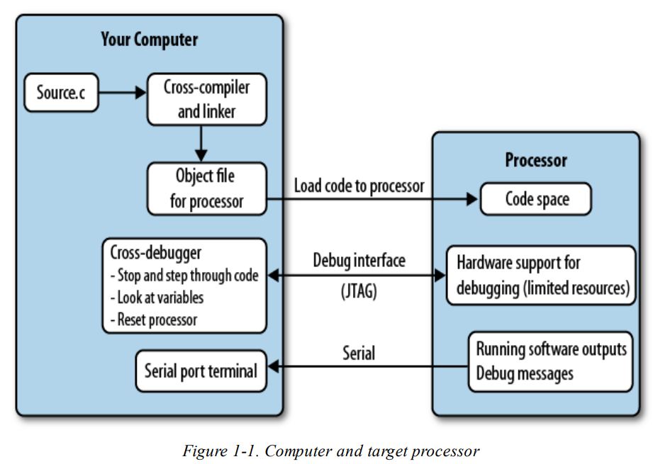

# Notebook 1

## Embedded Recommended Books

* Embedded Systems: Real-Time Operaing Systems for ARM Cortex-M Microcontrollers
* Making Embedded Systems
* The Firmware Handbook
* Pratical Reverse Engineering
* ARM Assembly Language: Fundamentals and Techniques
* Clean Code

## Recall Main Topics

**Core Embedded Concepts**
| Concept |Summary |
| --------|--------|
| Stack vs Heap | Stack = fast, small, used for local variables; Heap = dynamic, riskier in safety-critical. |
| Memory-Mapped I/O | Hardware peripherals are accessed via specific memory addresses. |
| ISR (Interrupt Service Routine) | Code that runs in response to a hardware interrupt. Keep ISRs fast and deterministic.|
| Polling vs Interrupts | Polling wastes CPU time; interrupts are efficient for event-driven designs. |

**Real-Time Operating Syste,s (RTOS) Basics**
| RTOS Element | Purpose |
|--------------|---------|
| Task (Thread) | Independent execution context, managed by scheduler. |
| Context Switch | Saving/restoring CPU state when switching tasks. |
| Semaphore |Used for resource sharing and signaling between tasks. |
| Mutex | Prevents race conditions when tasks access shared data. |
| Priority Inversion | Lower-priority task holding resource blocks higher-priority one, must be handled in critical systems. |

**Safety Critical Software**
| Principle | Meaning |
| ----------|---------|
| Determinism | Behavior must be predictable - no race conditions or timing surprises. | 
| Avoid malloc() | Dynamic memory causes fragmentation and nondeterminism. Prefer static allocation. |
| Watchdog Timer | Hardware timer that resets system if software hangs - critical for fault recovery. |
| Redundancy | Systems must tolerate failures gracefully - often have backup units or checks. |
| MISRA C | Safety coding standard for embedded C - restricts risky constructs like `goto`, recursion. |

**Debugging & Testing**
| Tool/Concept | Usage |
|--------------|-------|
| BReakpoints/Watchpoints | Pause or monitor variable access during execution. |
| Static Analysis (e.g. Cppcheck) | Detects bugs before running code. |
| Unit Tests | Small testable components. Use mocks for hardware. |
| Integration Tests | Full systems or subsystems interacting. |
| Code Coverage | Ensure all logic paths are tested, especially in certifications (e.g. aerospace DO-178C). |

**Binary & Firmware Awareness**
| Topic |Why it matters |
|-------|---------------|
| Linker Script | Defines memory layout (flash, RAM). Must match hardware. |
| Bootloader | First code run on power-up; may handle firmware updates. |
| Disassembly (e.g. Ghidra) | Helps understand compile code at instruction level. |

**Essential Tools**
| Tool | Purpose |
|------|---------|
| STM32CubeIDE / Keil / IAR | IDEs for ARM-based embedded development. |
| FreeRTOS | Popular RTOS with source code. Great for practice. |
| Ghidra | Reverse engineering / disassembly. |
| OpenOCD / ST_Link | Debugging tools for ARM boards. |


## Notes

___

### Making Embedded Systems

**Debugging**
Debugging an embedded system requires a cross-debugger, that allows to communicate with the target processor through a special processor interface, often called  JTAG.
<br>

**Resource Constrains**
Some under consideration include:
* Memory (RAM)
* Code space (ROM or flash)
* Processor cycles or speed
* Power consumption (which translates into battery life)
* Processor peripherals

**Core Principles from SW design to increase system flexibility**
- Modularity - separate the functionality into subsystems and hide the data each subsystem uses.
- Encapsulation - create interfaces between the subsystems so they do not know much about each other. 

<br>

**Example Interview Question:**
<br>*Here is a computer with a compiler and an editor. Please implement
“hello world.” Once you have the basic version working, add in the
functionality to get a name from the command line. Finally, tell me
what happens before your code executes—in other words, before the
main() function.*
1. *Hello World in C++:*
   ```cpp
   #include <iostream>

    int main(){
        std::cout << "Hello, world!" << std::endl;
        return 0;
    }
   ```

2. *Get the name from the command line:*
   ```cpp
    #include <iostream>

    int main(int argc, char* argv[]) {
        if (argc > 1) {
            std::cout << "Hello, " << argv[1] << "!" << std::endl;
        } else {
            std::cout << "Hello, world!" << std::endl;
        }
        return 0;
    }
   ```
   - argc is the number of arguments.
   - argv[0] is the program name.
   - argv[1] is the first argument passed (in this case, the name).
   - This uses proper C++ I/O (std::cout and std::endl), and the code is robust enough to handle missing arguments.

3. *What Happens Before `main()` Executes?*
 <br>
    A. On a typical Desktop:
    1. Startup Code -> Entry point provided by the C runtime (`_start`or `_crt0`):
        * This sets the runtime environment;
        * Initializes the stack pointer;
        * Parses command-line arguments and environment variables;
        * Calls constructors for global and static C++ objects;
        * Eventually calls `main()`.
    2. Global/Static Object Initialization:
        * All C++ global/static objects that have constructors are initialized in this phase;
        * This is handled by calling `_libc_csu_init()`or similar functions.
    3. Dynamic Linker/Loader:
        * If the binary is dynamically linked (e.g. with glibc), the loader maps libraries into memory, resolves symbols, and performs relocations.

    B. On an Embedded System (Bare Metal):
    1. Power-On Reset / Reser Vector:
        * The CPU starts executing from a fixed address, typically called the reset vector;
        * This points to the **startup code**, not `main()`.
    2. Low-Level Hardware Inits:
        * Clock setup (oscillators, PLLs);
        * Power rail stabilization (power sequencing and ramp-up time);
        * Flash wait-state configuration;
        * Optional watchdog disabling.
    3. Memory Initialization:
        * Zero out `.bss`(uninitialized global/static vars);
        * Copy `.data`(initialized global/static vars) from flash to RAM;
        * Stack pointer is initialized;
        * Sometimes heap is initialized.
    4. Interrupt Vector Table Initialization:
        * Set up the vector table (for exceptions and ISRs);
        * Configure base address of interrupt vector table.
    5. Global/Static C++ Constructors:
        * The startup code locates a table of construct function pointers and calls each one before entering `main()`.
    6. Jump to `main()`.

    *Bonus Notes:*<br>
    Why not instant startup after power-on?
    * Power must stabilize (~10s–100s of µs).
    * Clock sources (crystals, PLLs) must settle.
    * CPU reset must complete properly.
    * Flash memory may need wait states before use.
    * Peripherals might need initialization time before use.


