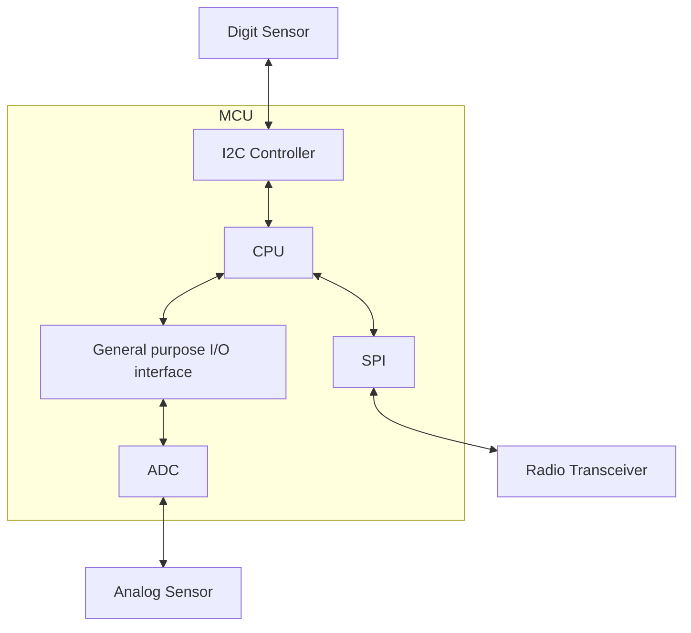

# Random Embedded Software Questions

# Part 1

### Name 4 Pillars of Object Oriented Programming

1. **Encapsulation** - bundle of data and methods that operate on the data into a single unit => an object, restricting direct access.
2. **Abstraction** - hides complex details and shows only essential features;
3. **Inheritance** - allows a class to inherit properties and behaviors from another class.
4. **Polymorphism** - enables one interface to be used for different data types and methods.


### What is the shortest way to return the sum of even numbers in an int array?

```cpp
int sumEven(int arr[], int size){
    return std::accumulate(arr, arr.size, 0, [](int sum, int n){
        return sum + (n%2 == 0 ? n : 0);})
}
```
or
```cpp
int sumEven(int arr[], int size){
    int sum = 0;
    for(int i=0; i<size; i++){
        if(arr[i]%2 == 0){
            sum += arr[i];
        }
    }
    return sum;
}
```

### What is the **startup code**?
Code called before the execution of main. it creates a platform for an application to run (initializes system HW and sets up the environment).


### What is a **Semaphore**?
A semaphore is a synchronization primitive used to control access to a shared resource among multiple threads or processes. It helps prevent race conditions and ensures proper synchronization.

* **Binary Semaphore** (0,1) => works like a mutex (lock/unlock), allows onl< one thread at a time.
* **Counting Semaphore** (>1) => allows a fixed number of threads to access a resource.

Example where only 2 threads can run at the same time:
```cpp
#include <iostream>
#include <thread>
#include <semaphore>  // C++20
std::counting_semaphore<2> sem(2); // Max 2 threads can enter
void task(int id) {
    sem.acquire();  // Decrease semaphore count (wait)
    std::cout << "Thread " << id << " is running\n";
    std::this_thread::sleep_for(std::chrono::seconds(1)); // Simulate work
    sem.release();  // Increase semaphore count (signal)
}
int main() {
    std::thread t1(task, 1), t2(task, 2), t3(task, 3);
    t1.join(); t2.join(); t3.join();
}
```


### ISR
**Interrupt Service Routines** - is a special function that runs automatically when an interrupt occurs, handling events like hardware signals or timers. Used when an interruption occurs, these procedures are started at a memory location in the Software.


### When to use **volatile**?
For variables that can change unexpectedly, preventing the compilöer from optimizing them away.

*E.g.: a variable set=1, that we later do while(variable), the compiler would optimize and remove this, and if changed by an interrupt ISR, it would miss is effect.*

*E.g., sed for memory-mapped registers, shared variables in ISR.*


### Thread vs Process

A **Process** is a program under execution running in seperate memory spaces, whereas a **thread** is a segment of a process, that shares information with other threads while containing its registers, counters, etc. .


### Interrupt latency?
Is the time taken by ISR to respond to an interrupt, the less the better.


### Can a variable be **volatile** and **const**?
Yes, const is only a promise.


### What is a **reentrant** function?
When a function can be interrupted during execution and can be called back safely, resuming from the same point it was left.

*Using a mutex one can make a function reentrant.*


### Loop-construct to ' VS cont up?
Countdown to 0, as it is better to compare to 0 as it is more optimized.


### What is a watchdog timer?
Prevents system from dangerous situations by detecting faults in advance.


### What is faster: '++i' or 'i+1'?
'++i' is faster as it uses single machine instruction, while the other requires loading for the addition.


### Can printf() be used inside ISR?
No, as it is a non-reentrant and thread-safe function.


### Can we pass or return a value in ISR?
Both are not allowed.


### Why interrupts latency happen?
* Signal sync with the CPU can take up to 3 CPU cycles to reach the process.
* After execution, it takes some extra CPU cycles to refill the pipeline again with the instructions.


### Levels of testing
1. Unit testing;
2. Integration testing;
3. System testing;
4. User acceptance testing.


### Types of buses in Embedded system?
* **Memory Bus** - memory-connected processes.
* **Multiplexed Bus** - reads and writes in memory.
* **De-multiplexed Bus** - two wires into the same Bus, one has the address and other the data.
* **Input/output (I/O) Bus** - is a communication pathway that allows multiple devices to share the same input and output signals for data transfer between the processor and peripherals.


### Scheduling Algorithms

| Algorithm | Pros | Cons |
|--|--|--|
| First-come, first-served (FCFS) |Simple and easy to implement. |Can cause long waiting times (convoy effect).|
| Shortest Job Nect (SJN) | Minimizes average waiting time. | Requires knowledge fo processes execution time, can cause starvation.|
|Round Robin (RR) |Ensures fairness, good for time-sharing systems. |High context-switching overhead if time quantum is too small.|


### Criteria for MCU selection?
* Power consuption
* Processing power
* Peripherals
* Memory
* Connectivity
* Cost
* Development ecosystem
* etc.


### MCU power saving methods
Low power mode, clock scaling, peripheral gating, dynamic voltage scaling, interrupts instead of polling, etc.


### MCU block diagram

Example:



### MPU vs MMU?
* **MPU** (Memory Protection Unit) → Enforces memory protection, but does not support virtual memory. Used in embedded systems.
* **MMU** (Memory Management Unit) → Handles virtual memory translation and memory protection. Used in OS-based systems.


### What happens after **power up**, before entering main?
The **start up code** runs, with reset vector execution, stack and heap setup, variable initializations, construct calls, etc..


### Program to transfer bytes from UART to ethernet (UDP) and blink a led, using some APIs?
* Use an interrupt-driven UART receive function;
* Forward received data to a UDP send function;
* Use a timer interrupt to blink the led periodically.

*Note*: **FTDI** => USB to serial (e.g. UART)


### What API would you create for working with a DMA controller?

* **DMA_Init()** - init specific settings;
* **DMA_SetDirection()** & **DMA_SetTransferSize()** - also configure source/destination addresses
* **DMA_Start()** & **DMA_STOP()** 
* **DMA_EnableInterrupt()** & **DMA_DisableInterrupt()**
* **DMA_IsTransferComplete()** & **DMA_ClearFlags()** - clear error flags
* **DMA_AlocateBuffer()** & **DMA_FreeBuffer()**

This API abstracts DMA configuration, control, and monitoring for easier use in embedded systems.


### I2C vs SPI vs UART

| Feature |I2C |SPI |UART |
|-|-|-|-|
| Pins required | 2 (SDA, SCL) | 4 (MOSI, MISO, SCL, CS) | 2 (TX, RX) |
| Speed | Slow (100kHz to 1 MHz) | Fast, more than 10-50MHz |Moderate, 1-2Mbps |
| Full/half-duplex |Half duplex |Full duplex | full duplex |
| Addressing | Uses device addresses | Select device via chip select | Point-to-point, no addressing |
| Communication type | Master-slave | Master-slave | Point-to-point |
| Bus complexity | More complex | Less complex | Moderate |
| Power consumption | Low |High | Moderate |

* **UART**: both can send data at any time, simple to use. Protocols/data arguments would be on you, since all is single bytes ==> E.g. USB - FTDI, Bluetooth, etc.
* **SPI**: One device controls when transfers go. E.g. ADC, oled display.
* **I2C**: Network, all devices can address other devices at any time. Works in packets. Every device needs an address. E.g. sensors (temperature).


### Structure packing: How does this differ in 8-bit architecture vs 32 bit? Can you save space by packing structures differently? Think about word alignment (and what a 'word' means in different architectures).

Structure packing differs between 8-bit and 32-bit architectures primarily in default alignment rules and the potential for space savings. 32-bit architectures typically have stricter alignment requirements (e.g., 4-byte alignment for integers), leading to more padding and larger structure sizes if packing isn't used. 8-bit architectures often have less stringent alignment (e.g., 1-byte alignment), so packing provides smaller savings. Packing, achieved via compiler directives or reordering, can always reduce structure size but might impact performance due to unaligned memory access, especially on 32-bit systems. Word size (1 byte vs 4 bytes) directly influences these alignment behaviors.

```cpp
//Example struct
struct Example {
    char a; //8bit = 1byte + maybe 1 byte padding; 32bit = 1 byte + 3 byte padding
    int b;  //32bit = 4 byte
    char c; //8bit = 1byte + maybe 1 byte padding; 32bit = 1 byte + 3 byte padding
};

//8-bit: No packing might be 4/6 bytes, packing likely also 4/6 bytes.
//32-bit: No packing might be 12 bytes (due to int alignment), packing is 6 bytes.
```


### Reverse a byte (or arbitrary length integer) in a function.


To reverse we want that the first bit is the last, so with bit shifting we go over each bit and save it starting from the end. 

```cpp
#include <iostream>
#include <cstdint>

uint64_t reverseBits(uint64_t n, int numBits) {
  uint64_t result = 0;
  for (int i = 0; i < numBits; ++i) {
    if ((n >> i) & 1) {
      result |= (uint64_t)1 << (numBits - 1 - i);
    }
  }
  return result;
}
```

E.g. `(num>>i)&1 = (5>>i)&1=(0101>>0)&1 = 0101&0001=1;` so we need to save 1 at the beginning, that is the full size-1: `result |= 1<<(size-1-i)`; 

Next iteration `(num>>i)&1 = (5>>1)&1=(0101>>1)&1 = 0010&0001=0;` 0 we dont need to add as we already initialized result as 0s.

Next iteration `(num>>i)&1 = (5>>2)&1=(0101>>2)&1 = 0001&0001=1;`, so we add the 1 that was on the 3rd position to the left, on the 3rd to the right. Same logic as before, we use *i* to move to that position as it should be mirrored: `result |= 1<<(size-1-2) => 1000|=1<<(4-3) => 1000|=1<<(1) => 1000|=10 =1010`; 


### Find if a string is a palindrome. 

A palindrome is a word, phrase, number, or sequence that reads the same forward and backward. E.g. *level*.

E.g. using std library and `s.rbegin()` that reverses that characters.
```cpp
#include <iostream>
#include <algorithm>
bool isPalindrome(const std::string& s) {
    return std::equal(s.begin(), s.begin() + s.size() / 2, s.rbegin());
}
int main() {
    std::string str = "racecar";
    std::cout << (isPalindrome(str) ? "Palindrome" : "Not a Palindrome") << std::endl;
}
```

Not using `std::equal`:
```cpp
#include <iostream>
bool isPalindrome(const std::string& s) {
    int left = 0, right = s.length() - 1;

    while (left < right) {
        if (s[left] != s[right]) {
            return false;  // Mismatch found, not a palindrome
        }
        left++;
        right--;
    }
    return true;  // No mismatches, it's a palindrome
}
int main() {
    std::string str = "racecar";
    std::cout << (isPalindrome(str) ? "Palindrome" : "Not a Palindrome") << std::endl;
}
```