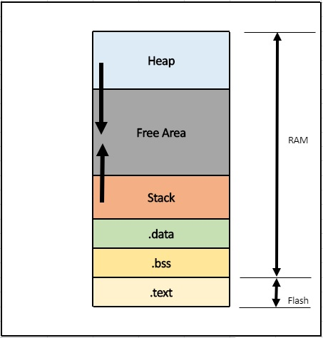
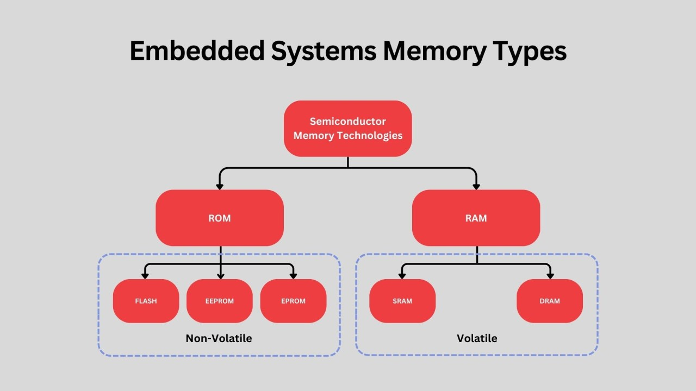
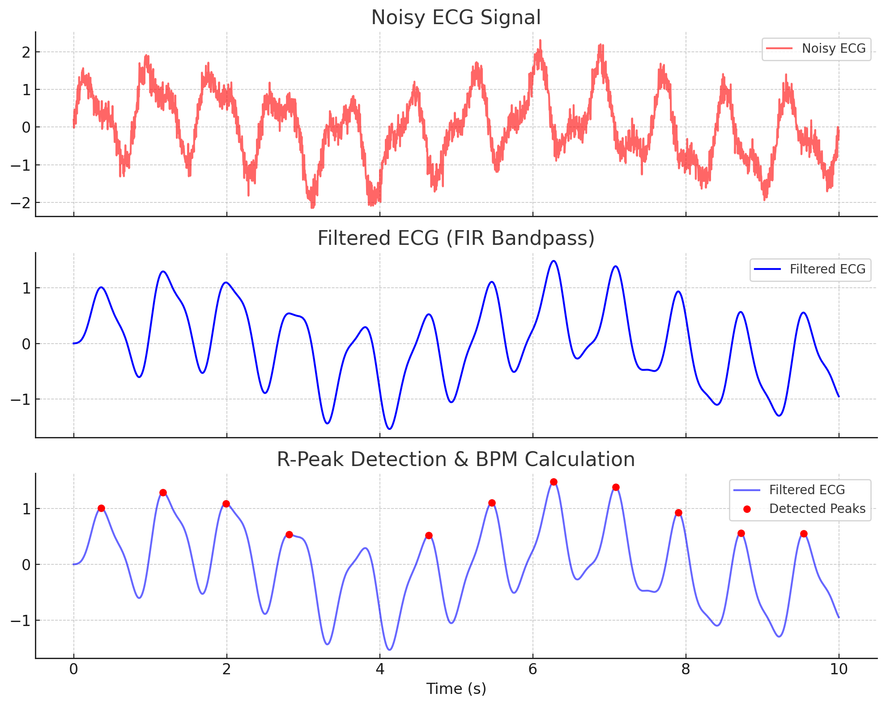

# Random Embedded Software Questions

# Part 2

### Memory

1. In which memory segment are static variables:

    Static variables are stored in the data segment of a program’s memory. This segment is divided into two parts:

    **Initialized Data Segment** – Contains static variables that are explicitly initialized.

    **Uninitialized Data Segment** (BSS - Block Started by Symbol) – Holds static variables that are declared but not initialized (defaulted to zero).

    Unlike local (stack) variables, static variables persist throughout the program's execution and retain their values between function calls. They are allocated at compile-time and exist in a fixed memory location.

2. What are the memory segments in embedded systems?

    In embedded systems, memory is divided into these segments:

    * **Code (Text) Segment** – Stores program instructions (Flash memory).

    * **Data Segment** – Stores global/static variables:

        * **Initialized Data** (explicitly initialized).

        * **BSS (Uninitialized Data)** (default initialized to zero).

    * **Stack** – Stores local variables, function calls (RAM).

    * **Heap** – Used for dynamic memory allocation (RAM).

    * **Interrupt Vector Table (IVT)** – Holds ISR addresses (Flash/RAM).

    * **Peripheral Memory (MMIO)** – Stores hardware registers (I/O mapped).

    * **Bootloader Segment** – Contains bootloader code (Flash).

        

        

3. Usually, bootloaders load the applciation from where to where?

    Usually bootloaders load the application from Flash (or other storage) into DRAM for execution. Here's why:

    * Flash memory (NOR/NAND) is non-volatile, meaning it retains data even when power is lost. This is where the firmware/application is stored.

    * DRAM (Dynamic RAM) is volatile, meaning it loses data when power is off. It is used for temporary storage and execution, not permanent flashing.

    How Bootloaders Work:
    1. The bootloader resides in Flash memory (ROM).

    2. A bootloader copies the application to DRAM during the boot process, typically in these steps:

    3. Bootloader Execution – The bootloader runs from Flash (ROM) after a reset or power-on.

    4. Loading the Application – It reads the application binary from Flash, SD card, or external storage.

    5. Copying to DRAM – If the CPU executes code from DRAM (common in high-performance systems), the bootloader copies the application there.

    6. Jumping to Execution – The bootloader transfers control to the application in DRAM.

    This happens when the CPU requires execution from DRAM (e.g., for speed or Flash write limitations). Some MCUs/MPUs can execute directly from Flash (XIP - eXecute In Place), skipping this step.

4. Can a hardware change a memory register?
    
    Yes, hardware (HW) can change a memory register, such as through a CPU executing instructions, DMA operations, or peripheral devices writing to memory-mapped registers.

### Signal Processing

Filters process signals by attenuating or enhancing specific frequency components. Key types and their uses for ECG signals include:

* Low-pass filter: Removes high-frequency noise (e.g., muscle artifacts).

* High-pass filter: Eliminates baseline wander (slow drift).

* Band-pass filter: Retains ECG-relevant frequencies (0.5–50 Hz).

* Notch filter: Removes powerline interference (e.g., 50/60 Hz).

* FIR (Finite Impulse Response) filter: Stable, linear-phase filtering, used for precision.

* IIR (Infinite Impulse Response) filter: Efficient but may introduce phase distortion.

* Wavelet transform: Detects features like QRS complexes via multi-scale analysis.

* Fourier transform: Analyzes frequency content for diagnosing abnormalities.

Example of filtering a noisy ECG filter to then gather its R-peaks:
    

### Tools

A good tool for signal and data/content visualization on HW devices is Saleae (or a cheaper clone that works with the same SW).

Saleae provides high-performance logic analyzers and software for debugging digital and mixed-signal systems. Its tools are widely used for protocol analysis, signal inspection, and embedded system debugging.

Key Features:
* Logic Analyzer Hardware: Captures digital (and some analog) signals.

* Saleae Logic Software: Visualizes and analyzes signals with various protocol decoders.

* APIs & SDKs:

    * Automation API: Python-based control for automated capture, export, and analysis.

    * Extensions API: Custom protocol decoders in Python or C++.

    * Logic 2 SDK: Extends capabilities for advanced signal processing.

Saleae is popular for debugging I²C, SPI, UART, CAN, USB, and other communication protocols in embedded systems.