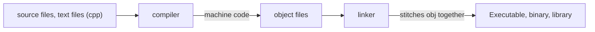

# C++

## C++



<br>

**Notes**
* **Preprocessor Statements:** "#" - pre-processor statement, is the first thing a compiler processes when receiving a file. Then it compiles. In the case of **include** it literally copies the content of that header file and places on this file, as if was a single one for compilation purposes.
* **Entry Point:** - "main" is the entry point for the application. does not have to return anything (default is 0). It is a special case, although we have it as ```int main(){}```.
* "<<" are an overload operator. Operators are just functions: ```std::cout << "ola" << "hi"``` could just be ```std::cout.print("ola").print("hi")```.
* ```std::cin.get();``` waits for user to press "Enter".
* **Solution Configuration** - Debug or Release = set of rules that applies to building of a project ; **Solution Platform** - x64 or x86 - the platform we're targetting with our current compilation.
* **Declaration** - statement that tells the compiler this symbol/function exists (is the function name declared, normally at the header).
* **/Definition** - this is what this function is/the body (is the actual logic code of the code).

## C++ Compiler