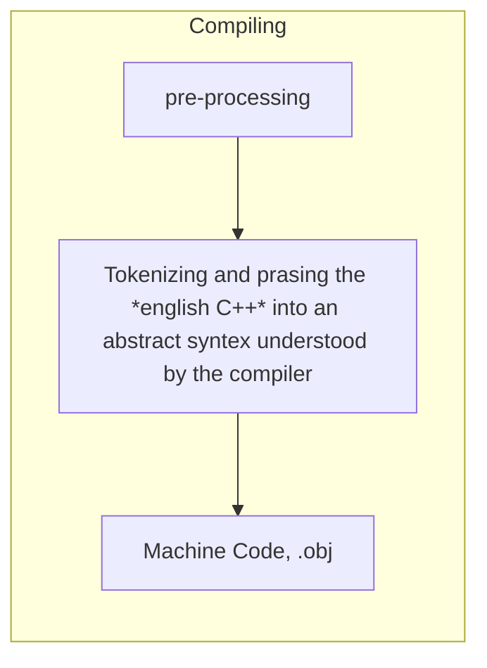

# C++


#### [Table of Contents](README.md#table-of-contents)


## Introduction


<br>

**Notes**
* **Preprocessor Statements:** "#" - pre-processor statement, is the first thing a compiler processes when receiving a file. Then it compiles. In the case of **include** it literally copies the content of that header file and places on this file, as if was a single one for compilation purposes.
* **Entry Point:** - "main" is the entry point for the application. does not have to return anything (default is 0). It is a special case, although we have it as ```int main(){}```.
* "<<" are an overload operator. Operators are just functions: ```std::cout << "ola" << "hi"``` could just be ```std::cout.print("ola").print("hi")```.
* ```std::cin.get();``` waits for user to press "Enter".
* **Solution Configuration** - Debug or Release = set of rules that applies to building of a project ; **Solution Platform** - x64 or x86 - the platform we're targetting with our current compilation.
* **Declaration** - statement that tells the compiler this symbol/function exists (is the function name declared, normally at the header).
* **/Definition** - this is what this function is/the body (is the actual logic code of the code).


## Compiler



* Each file, or cpp file, or if it includes others directly, ends up on a single translation unit (.obj)

* Pre-processes:
    * *#include* - just goes to the include file and copies and pastes the file here.
    * *#define INTEGER cherno* - will search for the "INTEGER" word in the file and replace it by cherno.
    * *#if* and *#endif* - checks conditions, this can be use for the compiler to ignore parts of code, etc. at pre-compile time.
* **obj file** it is a binary file. With Visual studio, for example, we can select throught the PReprocessor options to generate a readable file of the pre compilation, and from the Output Files an Assembly file of the compiled object file.
* Optimization - We can also change compilation optimizations for speed, space, etc. This, for example, can simplify the machine instructions (e.g. instead of doing `5x2`, just places directly `10` in memory).


## Linker

Finds where each symbol and function is and links them. Also checks for the entry point (main). So we can compile a file without a main, but get an error if build as an executable needs an entry point.

* The linker only has to link actually used code
* Declaring static means this method is only declared once on this translation unit.
* Use static - then this is only on that file scope
* Use inline - then it replaces this call by the content

There is static and dynamic linking. More of this in the future.


## Variables

Allow to name and store a piece or variable data, in stack or heap memory.

The actual only difference between variables is the size they occupy.


<div style="width: 100%; float: left;">

| Type          | Bytes | Bits  | Range Min                     | Range Max                     | Range Exponents of 2    | Range Exponents of 2 |
| --------------| ------| ------| ------------------------------|-------------------------------| ------------------------|----------------------|
| int8_t        | 1     | 8     |                       -128    |                       127     | -2^7                    | 2^7 - 1              | 
| int16_t       | 2     | 16    |                    -32 768    |                    32 767     | -2^15                   | 2^15 - 1             | 
| int32_t       | 4     | 32    |             -2 147 483 648    |             2 147 483 647     | -2^31                   | 2^31 - 1             | 
| int64_t       | 8     | 64    | -9 223 372 036 854 775 808    | 9 223 372 036 854 775 807     | -2^63                   | 2^63 - 1             | 
| uint8_t       | 1     | 8     | 0                             |                       255     | 0                       | 2^8 - 1              |
| uint16_t      | 2     | 16    | 0                             |                    65 535     | 0                       | 2^16 - 1             | 
| uint32_t      | 4     | 32    | 0                             |             4 294 967 295     | 0                       | 2^32 - 1             | 
| uint64_t      | 8     | 64    | 0                             | 18 446 744 073 709 551 615    | 0                       | 2^64 - 1             |
| char          | 1     | 8     | -128                          |                        127    | -2^7                    | 2^7 - 1              | 
| short         | 2     | 16    |                    -32 768    |                     32 767    | -2^15                   | 2^15 - 1             | 
| int           | 4     | 32    |             -2 147 483 648    |              2 147 483 647    | -2^31                   | 2^31 - 1             | 
| long          | 8     | 64    | -9 223 372 036 854 775 808    |  9 223 372 036 854 775 807    | -2^63                   | 2^63 - 1             | 
| float         | 4     | 32    | 3.4e-38                       | 3.4e+38                       | 2.9e-38                 | 2.3e+37              |
| double        | 8     | 64    | 1.7e-308                      | 1.7e+308                      | 1.7e-308                | 1.7e+308             | 
| long double   |10/12/16|96/112/128| 1.7e-4932                 | 1.7e+4932                     | 1.7e-4932               | 1.7e+4932            | 
| bool          | 1     | 8     | false                         | true                          | false                   | true                 |
| void *        | 8     | 64    | -9 223 372 036 854 775 808    | 9 223 372 036 854 775 807     | -2^63                   | 2^63 - 1             | 
| wchar_t       | 2     | 16    |                    -32 768    |                    32 767     | -2^15                   | 2^15 - 1             |
| char16_t      | 2     | 16    |                    -32 768    |                    32 767     | -2^15                   | 2^15 - 1             |   
| char32_t      | 4     | 32    |             -2 147 483 648    |             2 147 483 647     | -2^31                   | 2^31 - 1             |   
| nullptr_t     | 0     | 0     | 0                             | 0                             | 0                       | 0                    |   
| size_t        | 0 / 8 | 0 / 64| 0                             | 2^64 - 1                      | 0                       | 2^64 - 1             |   
| intptr_t      | 0 / 8 | 0 / 64| -2^63                         | 2^63 - 1                      | -2^63                   | 2^63 - 1             |  
| uintptr_t     | 0 / 8 | 0 / 64| 0                             | 2^64                          | 0                       | 2^64                 |   

</div>

E.g., a bool takes 8 bits instead of 8 because due to memory it uses the minimum, that is 1 byte=8bits. Of course, with some maneuvering and tricks we can manipulate memory up to bits level, if we know what we are doing :smile: 


## Functions

Functions are blocks of code that we write to perform a specific task. If part of a class, it is called method.